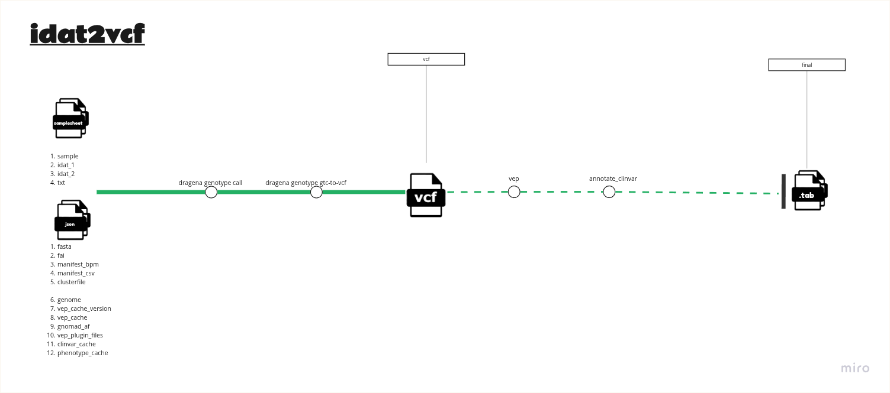

# 

## Introduction

**idat2vcf is a Synapsys pipeline for array-based variant calling. It converts IDAT files to VCF using the Illumina DRAGEN Array (DRAGENA) tools (IDAT → GTC → VCF), and can optionally annotate the VCF with Ensembl/VEP and ClinVar to produce an annotated tab-delimited file.

## Pipeline summary

<!-- prettier-ignore -->
<p align="center">
    
</p>


## Usage

> **Note**
> If you are new to Nextflow and nf-core, please refer to [this page](https://nf-co.re/docs/usage/installation) on how
> to set-up Nextflow. Make sure to [test your setup](https://nf-co.re/docs/usage/introduction#how-to-run-a-pipeline)
> with `-profile test` before running the workflow on actual data.

First, prepare a samplesheet with your input data that looks as follows:

`samplesheet.csv`:

```csv
sample,idat_1,idat_2,txt
test,test_Grn.idat,test_Red.idat,test.txt
```

Each row represents a pair of idat files.

Second, ensure that you have defined the path to reference files and parameters required for the type of analysis that you want to perform. 

Now, you can run the pipeline using:

```bash
nextflow run nf-core/raredisease \
   -profile <docker/singularity/podman/shifter/charliecloud/conda/institute> \
   --input samplesheet.csv \
   --outdir <OUTDIR>
```

> **Warning:**
> Please provide pipeline parameters via the CLI or Nextflow `-params-file` option. Custom config files including those
> provided by the `-c` Nextflow option can be used to provide any configuration _**except for parameters**_;
> see [docs](https://nf-co.re/usage/configuration#custom-configuration-files).

For more details and further functionality, please refer to the [usage documentation](https://nf-co.re/raredisease/usage) and the [parameter documentation](https://nf-co.re/raredisease/parameters).
